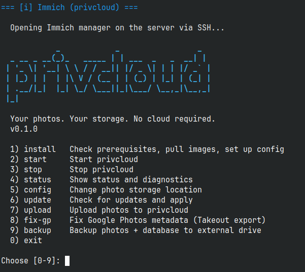
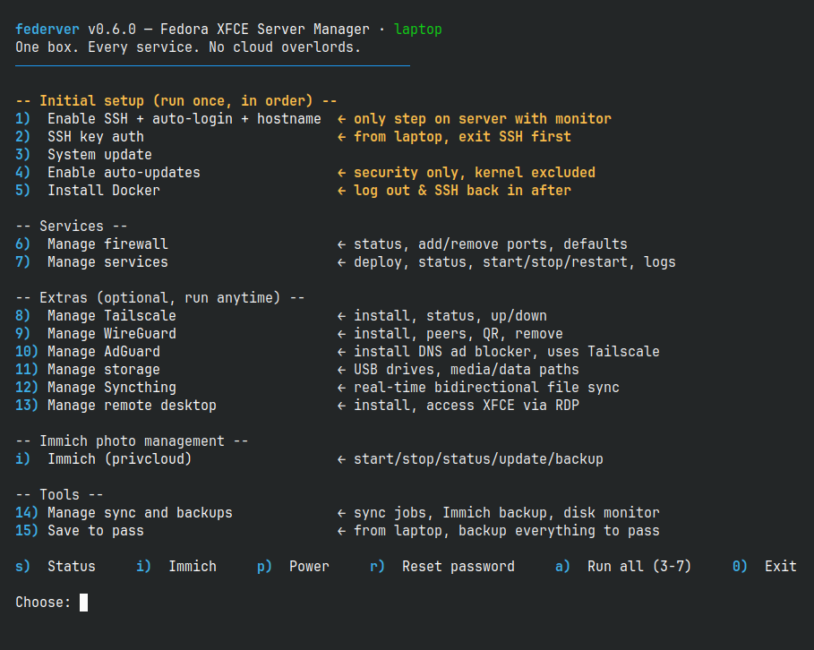

```
           _            _                 _
 _ __ _ __(_)_   _____ | | ___  _   _  __| |
| '_ \| '__| \ \ / / __|| |/ _ \| | | |/ _` |
| |_) | |  | |\ V / (__ | | (_) | |_| | (_| |
| .__/|_|  |_| \_/ \___||_|\___/ \__,_|\__,_|
|_|
```

<p align="center">
  <a href="package.json"></a>
  
</p>

**Your server. Your data. No cloud required.**

Self-hosted home server with photo backup, music streaming, file management, and remote access. Replaces iCloud, Google Photos, Google Drive — runs on a small mini PC at home and works from anywhere.

---

## Two ways to run it

### Just photo backup

Run on any laptop or desktop. No dedicated server needed. Start it when you want to sync, stop it when done.

```bash
git clone https://github.com/hamr0/privcloud.git && cd privcloud
privcloud install
privcloud start
# Open http://localhost:2283
```



### Full home server

Always-on machine running photos, music, files, monitoring, remote access, ad blocking — all in one. One script handles everything from a fresh Fedora install.

```bash
git clone https://github.com/hamr0/privcloud.git && cd privcloud
./setup.sh
```



---

## Setting up the full server

### What you need

- A **mini PC** with **Fedora XFCE 43** (8GB+ RAM, 128GB+ disk) — any small refurbished box works, e.g. HP ProDesk 400 G4 DM
- A **laptop** on the same network — macOS, Linux, or Windows with WSL (you'll run everything from here after the first boot)
- A **USB stick** (8GB+) for the Fedora installer, plus an **ethernet cable**
- About **30 minutes**
- *Optional:* a free [Tailscale](https://tailscale.com) account for remote access

### What you'll do

1. Flash Fedora XFCE to USB and install it on the mini PC
2. On the server (with a monitor): clone the repo and run `./setup.sh` → pick **1** to enable SSH
3. Unplug the monitor — everything from here runs from your laptop
4. On your laptop: clone the repo and run `./setup.sh` → pick **2** (SSH key), then **3 → 7** in order
5. Open your services in the browser — Immich at `:2283`, music at `:4533`, files at `:8080`

Every step is safe to re-run. Server steps auto-route via SSH; laptop steps run locally.

**→ Full click-by-click walkthrough: [customer-guide.md](customer-guide.md#server-setup-walkthrough)**

---

## What you get

| Service | What it does |
|---------|-------------|
| **Immich** | Phone photo backup with face recognition and smart search — like Google Photos, but yours |
| **Navidrome** | Stream your music to your phone, with background playback and offline cache |
| **FileBrowser** | Drop files in, grab them from any browser |
| **Uptime Kuma** | Tells you if anything goes down and sends a notification |
| **Tailscale** | Reach your server from anywhere — no port forwarding, no dynamic DNS |
| **WireGuard** | Route all your phone or laptop traffic through home — public WiFi privacy |
| **AdGuard Home** | Network-wide ad and tracker blocker for every device |
| **Syncthing** | Real-time folder sync between your devices |
| **Remote Desktop** | The full Fedora desktop, from any device |
| **Watchtower** | Keeps everything up-to-date automatically |
| **Backups** | One-time or scheduled (systemd timer) backups of your photos + Immich database — no downtime, defaults to an external drive |

---

## Docs

| Doc | What |
|-----|------|
| [Customer Guide](customer-guide.md) | Full setup walkthrough, service config, troubleshooting, maintenance |
| [Changelog](CHANGELOG.md) | Version history |

## License

Apache-2.0 — see [LICENSE](LICENSE).
